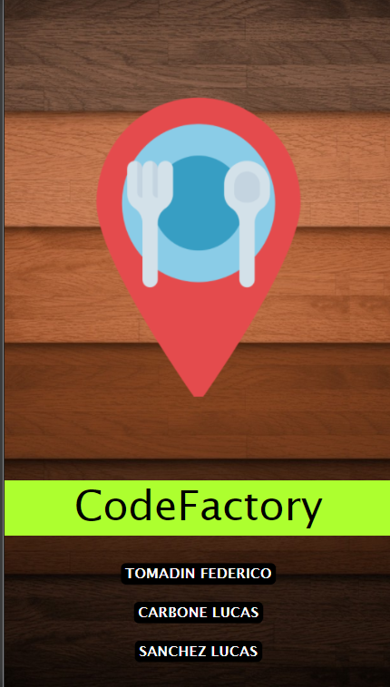
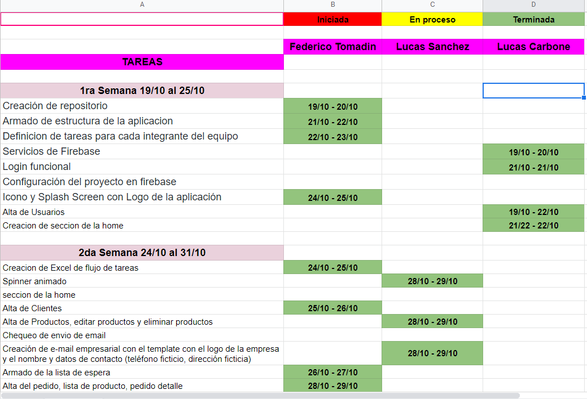

<h1>2020 - 2dogit cuatrimestre - PPS -- La Comanda</h1>

Para registrar el <strong>grupo completo</strong> con todos sus integrantes: https://forms.gle/MPuyrqVP83ahAY7K7

 

# "Caserito -- CodeFactory"
### Tienda de comida

<h4>Icono de CodeFactory</h4>

<h4>Splash</h4>

<h4>Spinner</h4>

## Integrantes
- Federico Tomadin
- Lucas Carbone
- Lucas Sánchez

## Branches
- Federico 
- LucasCarbone
- LucasSanchez

# Flujo de trabajo

## Códigos QR utilizados

Lista de espera:
|:--: |
|  | 

Mesas: 
| Mesa 1 | Mesa 2  | Mesa 3 | Mesa 4 | Mesa 5 |
|:--: | :--: | :--: | :--: | :--: |
|  | |  |  |  | 

Propinas: 
| Excelente | Muy bien  | Bien | Regular | Malo |
|:--: | :--: | :--: | :--: | :--: |
|  | |  |  |  | 

<h3> Código Qr - diagrama tentativo</h3>
  

